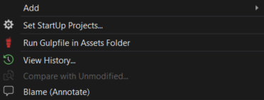

# Run Custom Gulp File
-------------------------------------------------
A Visual Studio extension for running custom located gulp file from solution context menu.
If you don't include the gulpfile.js to your solution, this is totally time saver for you.

See the [changelog](CHANGELOG.md) for updates and roadmap.

## Prerequisite
In order to use this extension, you must have nodejs and gulp-cli installed and configured gulp for project.

You can download
[NodeJS](https://nodejs.org/en/)
for free.

Than you can install
[gulp-cli](https://www.npmjs.com/package/gulp-cli)
globally.

### Run custom located Gulp file

You can run custom located gulp file by simply right-clicking it in Solution Explorer and select Run Gulpfile in Assets Folder.



On default, extension looks for [projectname].assets folder in solution and try to find gulpfile.js in that folder. If it finds, it will run Gulp.

### Create custom config file

If your directory structure different than extension defaults, you can customize it to your own structure.

Just create a assetsconfig.json file in your solution folder.
Add folder path and gulp parameters.

E.g.
```javascript
{
    CustomAssetDirPath: "MyOwnAssetFolder",
    GulpParameters: "build:dev --production false"
}
```

## Contribute
Check out the [contribution guidelines](CONTRIBUTING.md)
if you want to contribute to this project.

## License
[MIT](LICENSE)